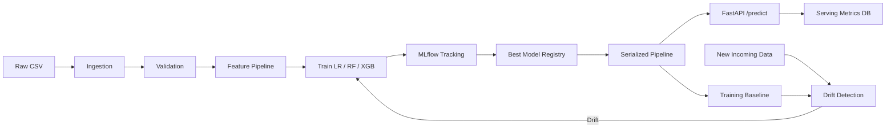

# Customer Churn Prediction ML System

Production-style end-to-end machine learning system for predicting customer churn on the BankChurners dataset. This project is intentionally structured like a small ML platform instead of a notebook-only workflow.

## Live Demo

- Hugging Face demo: [churn-ml-system](https://huggingface.co/spaces/santhoshprathik15/churn-ml-system)

## What This Project Demonstrates

- Data ingestion and cleaning
- Schema validation with Pandera
- Reusable sklearn preprocessing pipelines
- Training and comparison of Logistic Regression, Random Forest, and XGBoost
- MLflow experiment tracking and model registry
- FastAPI inference API
- Browser UI for prediction
- Persistent online serving metrics dashboard
- Drift detection and retraining trigger

## Architecture



## Project Structure

```text
churn-ml-system/
├── api/
├── data/
├── docs/
├── notebooks/
├── pipeline/
├── scripts/
├── src/
├── tests/
├── Makefile
├── README.md
└── requirements.txt
```

## Core Modules

- `config.py`: shared constants and paths
- `ingestion.py`: load, clean, and save processed data
- `validation.py`: Pandera schema validation
- `feature_pipeline.py`: preprocessing pipeline
- `train.py`: train models, evaluate, log to MLflow, register best model
- `evaluate.py`: classification metrics
- `drift.py`: KS-test drift detection and retraining trigger
- `pipeline/training_pipeline.py`: full training orchestration
- `pipeline/inference_pipeline.py`: production inference logic
- `api/main.py`: API routes, UI routes, and request metrics capture
- `api/monitoring.py`: persistent serving metrics store
- `api/ui.py`: prediction UI and dashboard HTML

## Dataset Expectations

Place the BankChurners file at:

```text
data/raw/BankChurners.csv
```

The project:

- converts `Attrition_Flag` to binary
- maps `Existing Customer` to `0`
- maps `Attrited Customer` to `1`
- drops `CLIENTNUM`
- drops all `Naive_Bayes_Classifier...` columns

## Setup

```bash
python3 -m venv .venv
source .venv/bin/activate
pip install -r requirements.txt
```

## Run Training

```bash
make train
```

Outputs:

- processed dataset in `data/processed/`
- MLflow metadata in `mlflow.db`
- MLflow artifacts in `mlartifacts/`
- serialized model in `models/churn_model.joblib`
- training baseline in `models/training_baseline.csv`
- model metadata in `models/model_metadata.json`

## Run MLflow UI

MLflow is intended for **local use in this project**.

Reason:

- the FastAPI app is the hosted demo
- MLflow is kept as a local experiment tracking and model registry tool
- this keeps deployment simpler and more stable for interviews

Default:

```bash
make mlflow
```

Custom port:

```bash
PORT=5001 make mlflow
```

Open:

- `http://127.0.0.1:5000`
- or `http://127.0.0.1:5001`

### Important note about MLflow portability

The repository can include:

- `mlflow.db`
- `mlruns/`
- training artifacts and model files

So if you lose your local setup later, you can clone the repo again and restore the project state.

To get MLflow back locally:

1. clone the repo
2. create the virtual environment
3. install dependencies
4. run the MLflow UI again

Example:

```bash
git clone <your-repo-url>
cd churn-ml-system
python3 -m venv .venv
source .venv/bin/activate
pip install -r requirements.txt
PORT=5001 make mlflow
```

If the committed MLflow tracking files are present in the repo, the historical runs and metrics will appear again in the UI.

## Run FastAPI

FastAPI is the part intended to be hosted as the live demo.

Default:

```bash
make api
```

Custom port:

```bash
PORT=8001 make api
```

Open:

- prediction UI: `http://127.0.0.1:8000/`
- dashboard: `http://127.0.0.1:8000/dashboard`
- docs: `http://127.0.0.1:8000/docs`

Hosted demo:

- [https://huggingface.co/spaces/santhoshprathik15/churn-ml-system](https://huggingface.co/spaces/santhoshprathik15/churn-ml-system)

## Demo Deployment Strategy

Recommended setup for interviews:

- host the FastAPI app and browser UI on a public service
- keep MLflow local
- use GitHub for source code, data, models, and tracked outputs

This gives you:

- a public demo link for interviewers
- a clean GitHub repo that shows the full project lifecycle
- a local MLflow UI you can still open whenever you want to discuss experiments

## Hugging Face Deployment

The hosted FastAPI demo is deployed from the `hf_app/` folder, which contains the inference-only deployment bundle for Hugging Face Spaces.

Recommended approach:

- keep this root repository as the full project showcase
- deploy only `hf_app/` to Hugging Face
- keep MLflow local

## API Example

```bash
curl -X POST "http://127.0.0.1:8000/predict" \
  -H "Content-Type: application/json" \
  -d '{
    "Customer_Age": 45,
    "Gender": "M",
    "Dependent_count": 2,
    "Education_Level": "Graduate",
    "Marital_Status": "Married",
    "Income_Category": "$60K - $80K",
    "Card_Category": "Blue",
    "Months_on_book": 36,
    "Total_Relationship_Count": 4,
    "Months_Inactive_12_mon": 1,
    "Contacts_Count_12_mon": 2,
    "Credit_Limit": 12000,
    "Total_Revolving_Bal": 800,
    "Avg_Open_To_Buy": 11200,
    "Total_Amt_Chng_Q4_Q1": 1.1,
    "Total_Trans_Amt": 4000,
    "Total_Trans_Ct": 65,
    "Total_Ct_Chng_Q4_Q1": 1.2,
    "Avg_Utilization_Ratio": 0.3
  }'
```

## Model Selection

The current version trains:

- 1 Logistic Regression configuration
- 1 Random Forest configuration
- 1 XGBoost configuration

The best model is selected by `roc_auc`.

This project currently compares one fixed configuration per model family. It does not yet run hyperparameter search.

## Online Serving Metrics

The dashboard tracks:

- total requests
- successful requests
- failed requests
- success rate
- average latency
- p95 latency
- requests per minute
- average predicted churn probability
- positive prediction rate
- recent predictions
- last error

These metrics are stored persistently in:

```text
serving_metrics.db
```

So they survive FastAPI restarts.

## Drift Monitoring

`drift.py` compares training baseline data with new incoming data using the Kolmogorov-Smirnov test on numerical features.

Behavior:

- drift is flagged when `p_value < 0.05`
- returns a per-feature drift report
- can trigger retraining automatically

## Interview Talking Points

- Why validation matters before training
- Why preprocessing is embedded in the sklearn pipeline
- Why ROC-AUC is used for model selection
- Why MLflow is used for training lineage while serving metrics are stored separately
- How drift monitoring closes the post-deployment loop

See:

- `docs/INTERVIEW_PREP.md`
- `docs/PORTFOLIO_BLURB.md`

## Testing

```bash
make test
```

## Suggested Next Improvements

- Hyperparameter tuning with cross-validation
- Better separation of validation vs final test set
- Dockerization and CI/CD
- Centralized observability
- Batch scoring and delayed-label production evaluation
